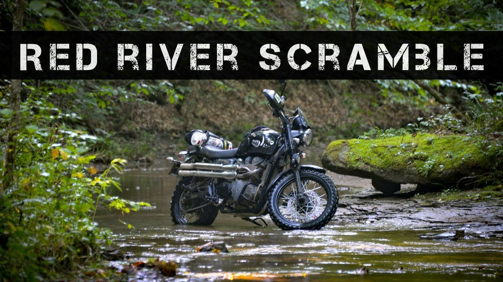

# Red_river_scramble
## Maps for the Red River Scramble Motorycle rally.

Red River Gorge September 24-27, 2020

Photo credit to [redriverscramble](https://redriverscramble.com)

A grassroots motorcycle rally with an emphasis on off-road riding in eastern Kentucky's Red River Gorge canyon system.

## Resources
* Event Website: [redriverscramble.com](https://redriverscramble.com)
* GPX files obtained from a participant rider in the 2020 year event
* DBBB Full Route [GeoJSON](DBBB_full_route_tracks.geojson)

Other routes to be considered as time permits:
* RRS Novice Adv Loop [GeoJSON](RRS_novice_ADV_Loop_tracks.geojson)
* RRS Intermediate ADV Loop [GeoJSON](RRS_intermediate_ADV_loop_tracks.geojson)
* RRS Pavement Master [GeoJSON](RRS_pavement_master_tracks.geojson)
* RRS Adventure Master [GeoJSON](RRS_adventure_master_tracks.geojson)
* RRS NE Dual Sport Loop [GeoJSON](RRS_NE_Dual_sport_loop_tracks.geojson)
* RRS NW Scenic paved loop [GeoJSON](RRS_NW_Scenic_paved_loop_tracks.geojson)
* RRS North Street Loop [GeoJSON](RRS_North_Street_Loop_tracks.geojson)
* RRS East Rustic Paved Loop [GeoJSON](RRS_east_rustic_paved_loop_tracks.geojson)
* RRS East Coal Country Paved Loop [GeoJSON](RRS_east_coal_country_paved_loop_tracks.geojson)
* RRS South Sweeper Loop [GeoJSON](RRS_south_sweeper_loop_tracks.geojson)
* RRS SW Twisty Paved Loop [GeoJSON](RRS_sw_twisty_paved_loop_tracks.geojson)
* RRS SW Dual Sport Loop [GeoJSON](RRS_sw_dual_sport_loop_tracks.geojson)
* RRS Central Dual-Sport Loop [GeoJSON](RRS_central_dual_sport_loop_tracks.geojson)
* RRS Dual-Sport Master [GeoJSON](RRS_dual_sport_master_tracks.geojson)
* RRS Covered Bridge Loop [GeoJSON](RRS_covered_bridge_loop_tracks.geojson)
* RRS DBNF FSR [GeoJSON](RRS_DBNF_FSR_tracks.geojson)
* RRS iron furnace loop [GeoJSON](RRS_iron_furnace_loop_tracks.geojson)
* RRS You Won't Make It CCW Extreme Dual [GeoJSON](RRS_you_wont_make_it_ccw_extreme_dual_tracks.geojson)
* Mountain Springs Bypass [GeoJSON](Mountain_springs_bypass_tracks.geojson)
* White Sulfur OHV Outer Loop [GeoJSON](White_sulfur_OHV_Outer_loop_tracks.geojson)

* DBBB Full CCW [GeoJSON](DBBB_full_CCW_track.geojson)
* DBBB rated [GeoJSON](DBBB_rated_tracks.geojson)
* DBBB Novice Tracks [GeoJSON](DBBB_novice_tracks.geojson)
* DBBB Intermediate [GeoJSON](DBBB_Intermediate_tracks.geojson)

## Intentions
To develop an embedded interactive Mapbox map option for riders to view an event route.
Would like to pursue the option of being able to display Relief/Elevation Range the way that the example given back in Module 9 showed (https://sheltoweetrace.com/hike/scenic/map/). This style of interactive map would allow a rider to accurately visualize topographic impacts on the route in addition to grasp the skill/ability level necessary to accomplish it.

